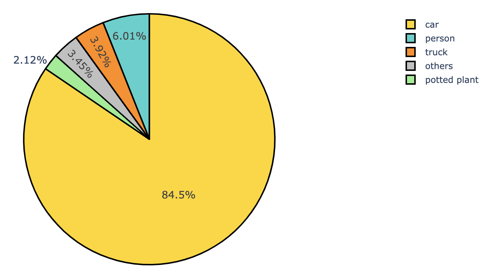
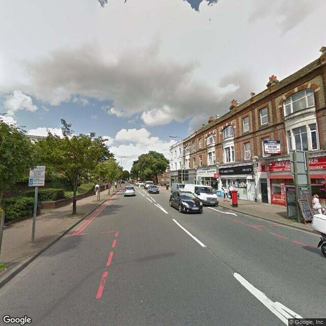

# Road Safety for Cyclists in London
[Jupyter Notebook](https://github.com/warcraft12321/RoadSafety/blob/master/RoadSafety.ipynb) | [Report](https://github.com/warcraft12321/RoadSafety/blob/master/text/report.pdf) | [Presentation](https://github.com/warcraft12321/RoadSafety/blob/master/text/presentation.pdf)

### Aim

The aim of this project was to use imagery to estimate safety on the roads of London, from a cyclist’s perspective. After
a brief introduction to the most important road safety indicators, a ranked list with several risk factors was compiled.
Risk factors were obtained from Google StreetView (GSV) imagery dataset using the object detection YOLOv5 (released in June 2020 by Glenn Jocher) and
image segmentation PSPNet101 (Pyramid Scene Parsing Network) (released in July 2017 by Hengshuang Zhao, Jianping Shi, Xiaojuan Qi, Xiaogang Wang and Jiaya Jia).

Imagery dataset contains 518 350 images of greater London, distributed across 4833 boroughs. Each image is labeled in accordance
to the LSOA it belongs. Images are organized in sets of 4 which corresponds to 4 90º angles from a total of 129 588 points.

Both YOLOv5 and PSPNet101 were benchmarked and validated using a set of 1 image per LSOA from the dataset.

Data was storage and processed in the secure High Performance Cluster from Imperial College London.

### Object Detection
YOLOv5 is the most recent version of YOLO which was originally developed by Joseph Redmon. First version runs in framework
called Darknet which was built specifically to execute YOLO.

Version 5 is only the 2nd model which was not developed by Joseph Redmon (after version 4) and the first running in the
state-of-the-art machine learning framework PyTorch.

This model was pre-trained using Coco dataset. Thus, it was able to identify 80 object categories. Distributed
over 11 categories.

Original            |  YOLOv5
:-------------------------:|:-------------------------:
  |  

[(Click to See 1 Image per LSOA)](https://drive.google.com/drive/folders/1G-EdZtO3bqRzG-OqnumDWjP08yihJ05q?usp=sharing)

#### Stats

  
 Click to Expand Table

  Original            |  YOLOv5
  :-------------------------:|:-------------------------:
  Car  |  1509344
  Person  |  107266
  Truck  |  70083
  Others  |  61624
  Potted Plant  |  37917

  

Original            |  YOLOv5
:-------------------------:|:-------------------------:
Car  |  1509344
Person  |  107266
Truck  |  70083
Potted Plant  |  37917
Bus  |  11512
Bicycle  |  10894
Motorcycle  |  8970
Traffic Light  |  6310
Bench  |  5013
Clock  |  2750

#### Files

File            |  Description
:-------------------------:|:-------------------------:
[total_stats.json](https://github.com/warcraft12321/RoadSafety/blob/master/yolov5/total_stats.json) |  Number of objects detected by YOLOv5 in GSV imagery by class
[lsoa_objects_number.json](https://github.com/warcraft12321/RoadSafety/blob/master/yolov5/lsoa_objects_number.json) |  Number of objects detected by YOLOv5 in GSV imagery by class and LSOA

[YOLOv5](https://github.com/ultralytics/yolov5)

### Image Segmentation

Image segmentation models reached a precision plateau (in terms of average IoU) in the previous 2 years. Due to their
long execution times, it was chosen the model executing faster and with the higher precision.

PSPNet101 was pre-trained in Cityscapes dataset. This way, it was able to label all pixels from an image across 100
categories.

Original            |  PSPNet101
:-------------------------:|:-------------------------:
  |  

[(Click to See 1 Image per LSOA)](https://drive.google.com/drive/folders/1fel8ew7h2eNJRMkXpv9lF4Zl1pydo4h-?usp=sharing)

#### Stats

#### Files

File            |  Description
:-------------------------:|:-------------------------:
[total_stats.json](https://github.com/warcraft12321/RoadSafety/blob/master/pspnet101/total_stats.json) |  Total Number of Pixels per Cityscapes Label in GSV Dataset
[rgb_label.json](https://github.com/warcraft12321/RoadSafety/blob/master/pspnet101/rgb_label) |  Conversion from RGB values to a Cityscapes label

[PSPNet101](https://github.com/hellochick/PSPNet-tensorflow)

### Supervisors
[Majid Ezzati](https://www.imperial.ac.uk/people/majid.ezzati) (Imperial College London) | [Ricky Nathvani](https://www.imperial.ac.uk/people/r.nathvani) (Imperial College London)

Featured in Towards Data Science (Medium) -> [Article](https://towardsdatascience.com/imperial-college-london-1c9bb442926)

Roadmap -> [Wiki](https://github.com/warcraft12321/RoadSafety/wiki)